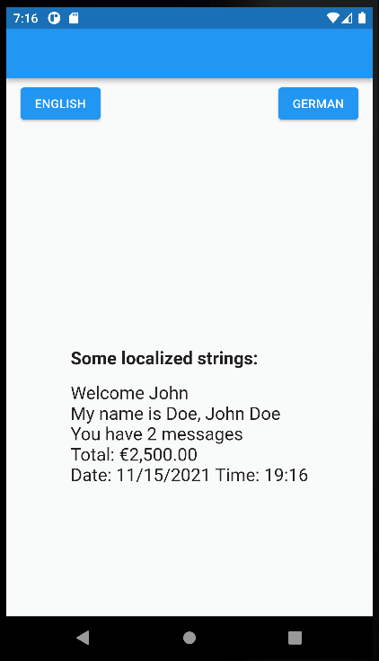

### Flutter app localization demo

This Demo app shows how to localize your Flutter apps with any of these:

- [Flutter Intl](https://marketplace.visualstudio.com/items?itemName=localizely.flutter-intl) extension for VS Code
- [Flutter Intl](https://plugins.jetbrains.com/plugin/13666-flutter-intl) plugin for IntelliJ / Android Studio
- [intl_utils](https://pub.dev/packages/intl_utils) Dart package (useful for CI/CD)

All of these use the same configuration (`flutter_intl`) inside `pubspec.yaml` file in order to generate localization files.

For [Over-the-air translation updates](https://localizely.com/flutter-over-the-air/) check out a dedicated [Flutter OTA Sample app](https://github.com/localizely/flutter-ota-sample-app/).
